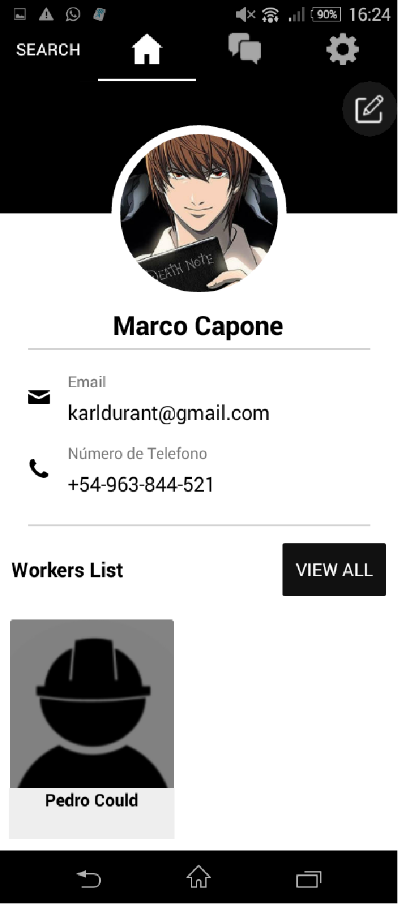
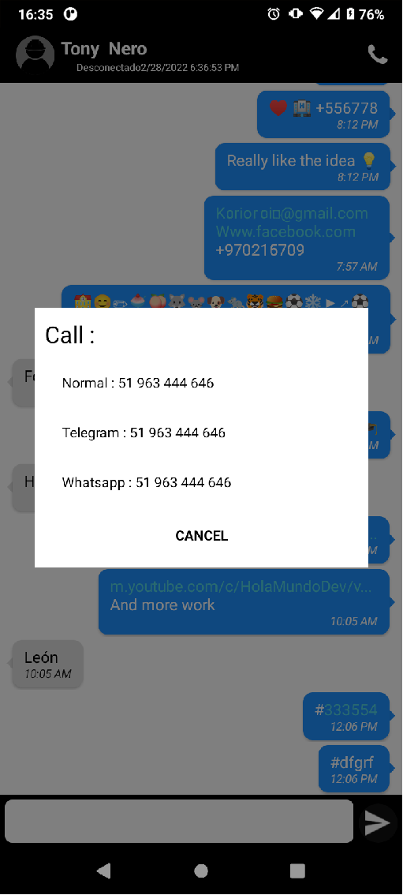

# **Yepa**

### **Description**

**Yepa** is a mobile application that connects users with nearby technical workers to request services such as carpentry, welding, electrical installations, goods transportation, and more. Workers can register to offer their services, and users can search for them based on their location, contact them through an integrated chat, email, or phone, and rate their services afterward.

The app acts as an intermediary, facilitating access to technical services in a simple and efficient way.

---

## **Key Features**

- **Sign Up and Log In:** Allows users and technical workers to create accounts, log in, and reset passwords.
- **Location-Based Search:** Users can find technical workers near their location.
- **Integrated Chat:** Enables direct communication between users and workers.
- **Worker Profiles:** Users can view detailed worker information, including experience and ratings.
- **Ratings:** Users can rate workers after completing a service.
- **Profile Management:** Allows users and workers to edit their profiles and configure settings.

---

## **Technologies and Architecture**

- **Programming Language:** C#
- **Framework:** Xamarin Forms
- **Cloud Services:**
  - Firebase:
    - **Realtime Database:** For real-time data storage.
    - **Authentication:** For user management.
    - **Storage:** For storing images.
  - OneSignal:
    - For push notifications, using Firebase Cloud Messaging (FCM) credentials.
- **Local Database:** SQLite, for on-device storage.
- **Location Model:** Custom algorithm based on coordinates to divide areas into quadrants, enabling efficient nearby worker searches.

---

## **Installation and Configuration**

### **Prerequisites**

- Android OS, version 4.4 or higher.
- Internet connection to access cloud services.

### **Installation Steps**

1. **Download the app:**
   - Install the APK directly on your Android device.
   - Alternatively, run the app in an Android emulator for testing.
2. **Initial Configuration:**
   - Ensure location access is enabled on your device.
   - Register or log in to access the app's main features.

### **Developer Setup**

1. Clone the repository.
2. Configure Firebase credentials in the `google-services.json` file.
3. Set up OneSignal for push notifications.
4. Install Xamarin Forms dependencies and set up the environment in Visual Studio.

---

## **Screenshots**
Android 4.4 and Android 11.0.
<table>
  <tr>
    <td style="vertical-align: bottom;">
      
      <p>SPLASH SCREEN</p>
    </td>
    <td style="vertical-align: bottom;">
      <br>
      <p>SIGN UP</p>
    </td>
    <td style="vertical-align: bottom;">
      <br>
      <p>SIGN UP WORKER</p>
    </td>
    <td style="vertical-align: bottom;">
      <br>
      <p>LOG IN</p>
    </td>
    <td style="vertical-align: bottom;">
      <br>
      <p>RESET PASSWORD</p>
    </td>
    <td style="vertical-align: bottom;">
      <br>
      <p>LOCATION PERMISSION</p>
    </td>
    <td style="vertical-align: bottom;">
      <br>
      <p>WORKS LIST</p>
    </td>
    <td style="vertical-align: bottom;">
      <br>
      <p>WORKS LIST WITHOUT LOCATION</p>
    </td>
    <td style="vertical-align: bottom;">
      <br>
      <p>WORKERS LIST</p>
    </td>
    <td style="vertical-align: bottom;">
      <br>
      <p>WORKER PROFILE</p>
    </td>
    <td style="vertical-align: bottom;">
      <br>
      <p>USER PROFILE</p>
    </td>
    <td style="vertical-align: bottom;">
      <br>
      <p>CHATS</p>
    </td>
    <td style="vertical-align: bottom;">
      <br>
      <p>CHAT 1</p>
    </td>
    <td style="vertical-align: bottom;">
      <br>
      <p>CHAT 2</p>
    </td>
    <td style="vertical-align: bottom;">
      <br>
      <p>CALL</p>
    </td>
    <td style="vertical-align: bottom;">
      <br>
      <p>SETTINGS</p>
    </td>
    <td style="vertical-align: bottom;">
      <br>
      <p>NOTIFICATION</p>
    </td>
  </tr>
</table>

---

## **Location Algorithm Functionality**

The location system is based on geographic coordinates (latitude and longitude) and uses a unit of 0.05 degrees to define areas. These areas are mapped in Firebase as organized lists within an imaginary rectangular framework.

To search for workers, a central point is defined, and a square covering the region is drawn, divided into four smaller quadrants. The search is performed sequentially in these quadrants, prioritizing the nearest distance.

This approach is inspired by Uber's model, which uses hexagons, but here it is implemented with quadrants for simplicity (no backend is involved). Each 0.05-degree unit corresponds approximately to a radius of 5.56 km, optimizing the process for identifying nearby technical workers.

**Example Code for the Location Model:**

```csharp
public static void SetArea()
{
    double NormalDistance = 0.050;
    var longitud = Placemark.Location.Longitude;
    var latitude = Placemark.Location.Latitude;
    var Longitude0 = Math.Round(longitud / 5, 2) * 5;
    var Latitude0 = Math.Round(latitude / 5, 2) * 5;

    // Define areas by coordinates
    var Area = new LocationModel[4][]
    {
        new LocationModel[4]
        {
            new LocationModel(Math.Round(Latitude0-NormalDistance,2),Math.Round(Longitude0+NormalDistance,2)),
            ...
        },
        ...
    };

    // Calculate distances and organize areas
    for (int i = 0; i < 4; i++)
    {
        var getItem = MiddleArea[i];
        var getDistance = Location.CalculateDistance(latitude, longitud, getItem.Latitude, getItem.Longitude, DistanceUnits.Kilometers);
        Areas.Add(new AreaModel(getDistance,Area[i]));
    }

    Areas = new List<AreaModel>(Areas.OrderBy(i => i.Distance));
}
```

---

## **Roadmap**

- Complete reimplementation in **React Native** to enhance cross-platform support.
- Integration of maps (e.g., Google Maps) for real-time worker visualization.
- Addition of online payment options directly within the app.
- Improvement of the notification system.

---

## **Credits and License**

- **Author:** Developed by Karl Raven Schwarz.
- **License:** Open-use. This app was primarily created as a showcase project, but it is functional.
- **Third-Party Resources:**
  - [Fontello](https://fontello.com): For custom icons.
  - [Firebase](https://firebase.google.com): For cloud services.
  - [OneSignal](https://onesignal.com): For push notifications. 